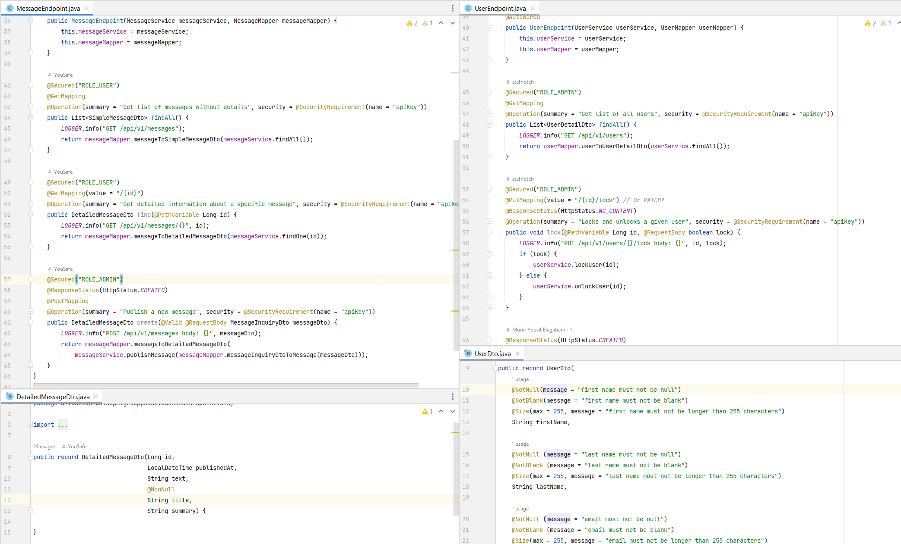
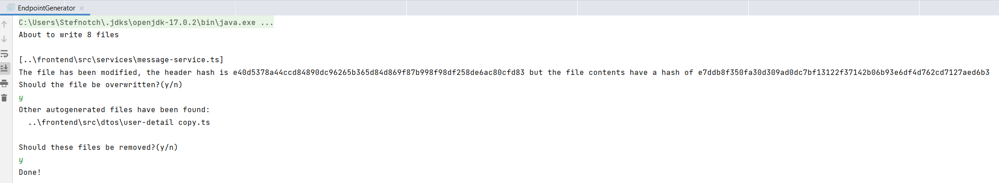
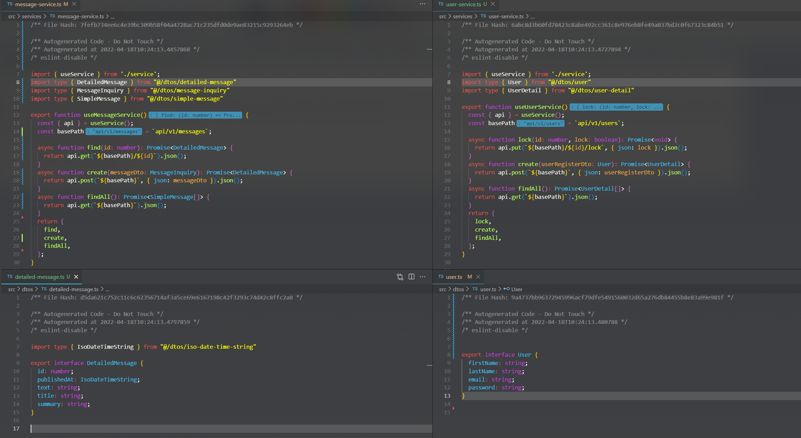

# Code Generator!

Magic 🌈

The `EndpointGenerator.java` takes a bunch of Java Spring REST Endpoints and generates frontend code to effortlessly call those endpoints. This includes, but is not limited to:

- Reading every endpoint method
    - Get/Put/Post/Delete
    - Name of method
    - Parameters
    - Return type
- Generating services
- Generating interfaces and types for the DTOs (method parameters and return type can use entire classes/records)
    - This includes rudimentary support for generics
- Handling the whole path parameter, query parameter and body parameter stuff
- Computing a hash of the generated code and putting that into the file
    - That way, we can detect if generated code doesn't match its hash. This is usually the case if someone *manually* edited a generated file. Whenever this happens, we politely warn the user.
- Realizing that Java's `String.split()` has a few silly edge cases

## Screenshot time!

The code generator takes an input like the following files.
(The user has to reference the `MessageEndpoint` and the code generator discovers the rest.)

Then the code generator is started

And it politely spits out the following frontend code

